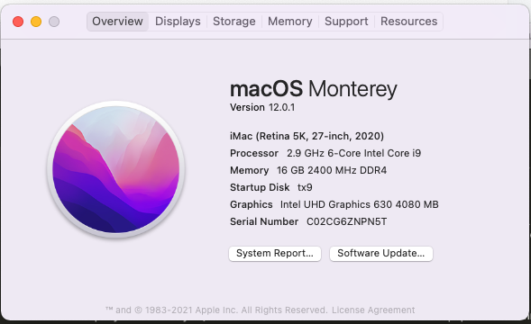

# Opencore-Tx9cu5da

## Known Device May Work
`tx9-cu5da` `tx9-cu5dk` `tx8` `tx7` `tx6`

## KeyStep
You should using tools to unblock the `Aperture Size` setting in bios and set it to "512MB", then you are ready to go.

## Notice
- Edit bios may cause unrecoverable errors and harm the computer, please be careful,

- Each device model need specific tool to backup and edit the bios, you need to find on the manufacturer support page

- Setup your own `SM-BIOS` info

  

## Known Issues
- external display not work yet, but it's known that the second mini-dp port is connected to the `uhd630`, so it's theoretical supported
- ps2 mouse is not woking, tracking-pad works.

# Device Info

| Hardware         | Model       | Remark                                                       |
| ---------------- | ----------- | ------------------------------------------------------------ |
| CPU              | I5-10400    | Power management not perfect                                 |
| Memory           | 16GB        |                                                              |
| Graphics         | uhd630      | RTX2070 won't work                                           |
| WIFI & Bluetooth | DW1560      | Working                                                      |
| Trackpad         |             | partial working under ps2 \n mouse key not recognized        |
| Screen           | 1080p@144   |                                                              |
| External display |             | not working yet, but it's hopeful                            |
| USB              |             | Working, Type port working                                   |
| Battery          |             | Working                                                      |
| Audio            |             | Working                                                      |
| Camera           |             | Working                                                      |
| Card Reader      |             | Not tested                                                   |
| Mother-Board     | N960sc      | H470                                                         |
| Ethernet         |             | Not tested                                                   |
| Disk             | PCIE + SATA | Secondary PCIE is sharing brand-width with SATA so it won't work |

# Credit

You are welcomed to share your setting and achievement

Original Work from `wfx1024`: https://github.com/wfx1024/clevo-NKx0SB_SE_Hackintosh

BIOS Config Steps: https://bbs.pcbeta.com/viewthread-1867971-1-1.html

Bios tools page: http://kfgl.hasee.com/lookup/bios/bios_nb.asp
